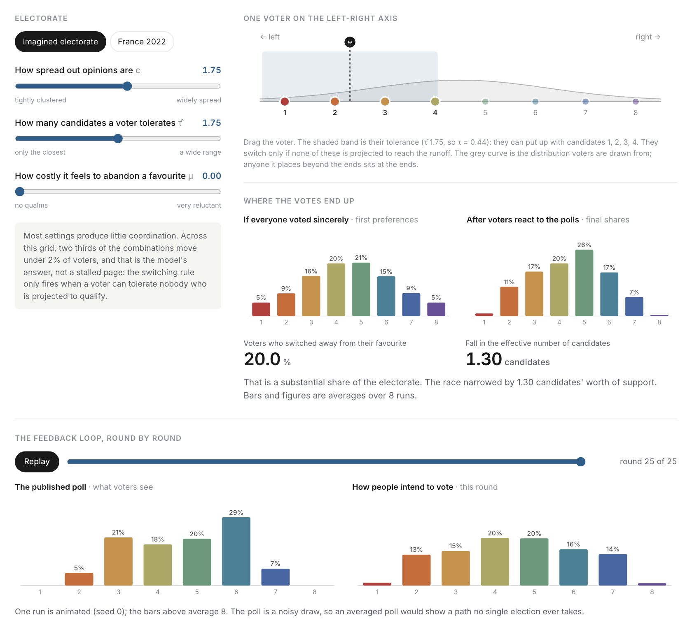

<h1 align="center">Strategic voting in two-round elections</h1>

<p align="center">
An agent-based model of voters who abandon their favourite candidate when nobody they can tolerate
looks likely to reach the runoff, replayed against the French presidential first rounds of 2002 and 2022.
</p>

<p align="center">
  <a href="https://clarasalas.github.io/strategic-voting-abm-2RS/">
    
  </a>
</p>

<p align="center">
  <a href="https://clarasalas.github.io/strategic-voting-abm-2RS/">
    
  </a>
</p>

<p align="center"><sub>
Move three sliders and watch the poll and the votes pull on each other, then open the cards below it for the model,
how it is checked, and how to reproduce it. Every trajectory on the page was computed by the Python model.
</sub></p>

<p align="center">
  <a href="https://github.com/clarasalas/strategic-voting-abm-2RS/actions/workflows/tests.yml"></a>
  
</p>

## About

In a two-round election, a voter whose favourite cannot reach the runoff can vote sincerely and risk having
nobody they like in round two, or switch to a compromise candidate who can qualify. This model follows that choice
for thousands of voters at once.

Voters sit on a left-right axis. Each one reads a public poll, works out which candidates they can tolerate, and
guesses which two will reach the runoff. They switch only when none of their tolerable candidates is among those
two, and only when the gain outweighs the cost of leaving their favourite. The new vote intentions feed the next
poll, so the polls and the votes evolve together.

The model runs in two modes. The synthetic mode generates the electorate and the polls, and asks which parameters
drive coordination. The empirical mode uses the real candidates, voters and poll timeline of 2002 and 2022. 2002 is
the textbook coordination failure, when the left split and its front-runner missed the runoff; 2022 is the
contrasting case. One behavioural setting is applied to both years, and nothing is fitted to either election.

The analysis is in progress toward an article and the mechanism is under revision, so the repository makes no
claims here about what the model shows.

## Quick start

```bash
git clone https://github.com/clarasalas/strategic-voting-abm-2RS.git
cd strategic-voting-abm-2RS
pip install -e .
```

```python
from core_model.model import run_simulation
from core_model.metrics import tau_absolute, enp

K = 8
r = run_simulation(K=K, n_modes=1, width_factor=1.5, theta=1.0, rho=100.0,
                   rho_pi=100.0, n_electors=500, tau=tau_absolute(1.75, K),
                   mu=0.1, alpha_prior=0.0, K_runoff=2, max_iterations=15,
                   seed=42, verbose=False, collect_diagnostics=True)
print(f"ENP {enp(r['sincere_shares']):.3f} -> {enp(r['final_shares']):.3f}")   # ENP 5.441 -> 5.208
```

Those exact numbers are pinned by a regression test. To run the full test suite:

```bash
pip install pytest && pip install -e ".[analysis]"
python -m pytest -ra
```

<details>
<summary><strong>How it is checked</strong></summary>

<br>

The test suite runs in CI on every push and pull request, and numerical warnings count as failures. It exists
because an earlier round of empirical results was invalidated by a unit-conversion error that every figure had
looked plausible under. The checks fall into 17 families, among them:

* **Hand-computed values**: metrics match closed-form results to 1e-12.
* **The decision rule**: hand-built voters check that the trigger fires exactly when it should, and that the
  choice flips at the analytically derived cost.
* **Symmetry**: relabelling the candidates or mirroring the axis must not change any decision.
* **Golden regressions**: full output vectors are pinned, so a change that moves every number fails.
* **Reproducibility**: fixed seeds throughout; derived tables regenerate byte-for-byte; runs refuse to overwrite
  output without a flag; interrupted sweeps resume to identical results.
* **The interactive page**: its data are re-checked against the model, so the page cannot drift from the code.

Full record: [docs/validation.md](docs/validation.md).

</details>

<details>
<summary><strong>Repository layout</strong></summary>

```
core_model/              the model: agents, iteration loop, signals, metrics (pip install -e .)
analysis/
  synthetic/             Sobol sensitivity, protocol validation, robustness panels
  empirical/             2002/2022 replay, behavioural sweeps, diagnostics
data/                    candidates, polls, results and voter ideology for 2002 and 2022
results/tables/          22 compact CSVs: the citable numbers
tests/                   the test suite
tools/                   pipeline driver, output validator, evidence archiver
demo/precompute.py       runs the model over the page's grid -> docs/data/grid.json
docs/
  index.html             the interactive page (GitHub Pages)
  *.md                   the detailed documentation
```

Raw simulation output and figures are git-ignored on purpose: they are bulky and regenerate from a seed. Only the
derived tables are committed. See [analysis/README.md](analysis/README.md) for which script needs which.

</details>

<details>
<summary><strong>Documentation</strong></summary>

<br>

| | |
|---|---|
| **[Model](docs/model.md)** | Entities, one full iteration, initialisation, tolerance units, the decision rule, outcome measures. |
| **[Validation](docs/validation.md)** | The 17 check families, what each guarantees, current status. |
| **[Experiments](docs/experiments.md)** | Parameter spaces, seeds, simulation counts, data provenance. |
| **[Reproducibility](docs/reproducibility.md)** | Install, run, regenerate, verify. |
| **[Code map](docs/code_map.md)** | Repository architecture, and which definitions are canonical. |
| **[Result tables](results/README.md)** | All 22 tables: contents, generating script, inputs, regeneration command. |

</details>

<details>
<summary><strong>The interactive page</strong></summary>

<br>

[`docs/index.html`](docs/index.html) is a static page published with GitHub Pages from the `docs/` folder of `main`.
It computes nothing itself: it replays trajectories that
[`demo/precompute.py`](demo/precompute.py) computed with the real model over 660 settings × 8 seeds (about 40
minutes), stored in `docs/data/grid.json`.

```bash
python demo/precompute.py --force       # regenerate the data after a model change
python -m http.server -d docs           # preview at http://localhost:8000
```

`tests/test_demo_data_matches_model.py` re-runs the model on a few cells and fails if the stored data no longer
match it.

</details>

<details>
<summary><strong>Data sources</strong></summary>

<br>

* **Polls**: the French Wikipedia lists of polls for the
  [2002](https://fr.wikipedia.org/wiki/Liste_de_sondages_sur_l%27%C3%A9lection_pr%C3%A9sidentielle_fran%C3%A7aise_de_2002)
  and [2022](https://fr.wikipedia.org/wiki/Liste_de_sondages_sur_l%27%C3%A9lection_pr%C3%A9sidentielle_fran%C3%A7aise_de_2022)
  elections.
* **Voter ideology**: left-right self-placement in the CSES, Module 2 (France 2002) and Module 6 (France 2022).
* **Candidate positions**: respondents' placements of the candidates: CSES 2002, and the Ipsos–CEVIPOF
  Enquête électorale 2022, wave 9. Six minor 2002 candidates are imputed.
* **Election results**: Ministère de l'Intérieur.

Provenance and processing: [docs/experiments.md → Data sources](docs/experiments.md#data-sources).

</details>

---

<sub>Master's thesis project, ENS-PSL / Centre Borelli. Companion project on the geography of coordination:
[strategic-voting-geo-2RS](https://github.com/clarasalas/strategic-voting-geo-2RS).</sub>
