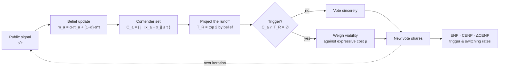

# Strategic Voting in Two-Round Elections

An agent-based model of strategic voting under a two-round runoff, replayed
against the French presidential first rounds of 2002 and 2022.

[](https://github.com/clarasalas/strategic-voting-abm-2RS/actions/workflows/tests.yml)
[](docs/reproducibility.md)
[](docs/experiments.md#data-sources)

> **[Model & Validation Guide](docs/index.md)** is the canonical technical
> documentation. It covers how the model works, how it is verified, and how to
> reproduce every number quoted here.

> The test suite runs in CI on every push and pull request. Local runs are
> recorded with their date and commit in the
> [verification snapshot](docs/validation.md#verification-snapshot).

---

## What is this?

Voters sit on a left-right axis. Each has a sincere preference, watches a public
poll signal, and forms beliefs about who will reach the two-candidate runoff. A
voter abandons their preferred candidate only when no candidate they can
tolerate is projected to qualify. Otherwise they vote sincerely.

The model asks what aggregate coordination that rule produces, and whether it
matches two real elections with opposite outcomes.

## Why was it built?

2002 is the textbook coordination failure: the French left split its vote across
several candidates and its front-runner missed the runoff entirely. 2022 is the
contrasting case, with visible consolidation.

There is no fitting step anywhere in the project. One behavioural draw is
applied to both years and only the environment changes. This is a research
prototype meant to demonstrate a coherent scientific and engineering process,
and it makes no attempt to predict elections.

## How does it work?



In each iteration voters see a poll, update beliefs, work out who they can
tolerate, and project who will qualify. They switch only if no tolerable
candidate can make it, and only if the gain outweighs the cost of abandoning
their favourite.

Two modes share the same core. Synthetic mode generates the electorate and the
poll signal, and asks which parameters drive coordination. Empirical mode holds
the real candidates, electorate and poll timeline fixed, and asks whether the
2002/2022 contrast comes out.

→ [Full model description](docs/model.md)

## What practices does it demonstrate?

| | |
|---|---|
| **Layered testing** | 570 tests across 17 contract families: analytic fixtures, decision-rule tests, dynamic invariants, metamorphic properties, golden regressions, pipeline contracts. |
| **Metamorphic testing** | Relabelling and left-right reflection invariance were derived from the equations before anything asserted them. |
| **Golden-value regressions** | Full output vectors pinned to 1e-12, so a refactor that moves every code path equally still fails. |
| **Reproducibility as a contract** | Fixed seeds throughout. Derived tables regenerate byte-identically, verified by a test that compares serialized bytes rather than parsed floats. |
| **Destructive-operation safety** | Runs refuse to overwrite output without an explicit flag, smoke runs live in a separate directory, and sweeps resume to byte-identical results. |
| **Honest units** | The τ̂ to τ conversion happens in exactly one place, and every output row records both values plus *K*, so the relation is checkable from the CSV alone. |
| **Documented failure** | A tolerance-unit defect was found, corrected, and the full 14 000-simulation pipeline re-run under a validated protocol. |

→ [Validation record](docs/validation.md)

## Run a smoke example

```bash
git clone https://github.com/clarasalas/strategic-voting-abm-2RS.git
cd strategic-voting-abm-2RS
pip install -r requirements.txt

python -c "
import sys; sys.path.insert(0, 'core_model')
from model import run_simulation
from metrics import tau_absolute, enp
K = 8
r = run_simulation(K=K, n_modes=1, width_factor=1.5, theta=1.0, rho=100.0,
                   rho_pi=100.0, n_electors=500, tau=tau_absolute(1.75, K),
                   mu=0.1, alpha_prior=0.0, K_runoff=2, max_iterations=15,
                   seed=42, verbose=False, collect_diagnostics=True)
print(f\"ENP {enp(r['sincere_shares']):.3f} -> {enp(r['final_shares']):.3f}\")
print(f\"winner party {r['winner_id']}, {r['switching']['strategic']}/500 switched\")
"
```

```
ENP 5.441 -> 5.208
winner party 4, 19/500 switched
```

Those exact numbers are pinned by a golden regression test.

```bash
pip install pytest scikit-learn
python -m pytest -ra          # 570 passed, 0 skipped, 0 warnings
```

→ [Installation and full commands](docs/reproducibility.md)

## Repository map

| Path | Contents |
|---|---|
| [`core_model/`](core_model) | The model: agents, iteration loop, metrics, signals. No analysis. |
| [`analysis/synthetic/`](analysis/synthetic) | Sobol sensitivity, protocol validation, robustness panels. |
| [`analysis/empirical/`](analysis/empirical) | 2002/2022 replay, behavioural sweeps, diagnostics. |
| [`tests/`](tests) | 20 files, 570 tests, no skips. |
| [`results/tables/`](results/README.md) | 22 compact CSVs, the citable numbers. |
| [`docs/`](docs/index.md) | The Model & Validation Guide. |
| [`tools/`](tools) | Pipeline driver, output validator, evidence archiver. |

Raw simulation output and figures are git-ignored on purpose: they are bulky and
regenerate from a seed. Only the derived tables are committed.

→ [Architecture and canonical definitions](docs/code_map.md)

## Documentation

The Markdown documentation in this repository is the canonical version.
Everything needed to understand, verify or reproduce this project lives under
[`docs/`](docs/index.md) and reads directly on GitHub, with no documentation
site, no build step and no external service.

A [navigable single-page rendering](https://clarasalas.github.io/strategic-voting-abm-2RS/guide.html) of the same material is published
through GitHub Pages as a convenience mirror. Treat it as optional. It is
generated from the Markdown, it carries no authority, and nothing here depends
on access to it. Where the two differ, the repository is correct.

## Learn more

| | |
|---|---|
| **[Model](docs/model.md)** | Entities, one full iteration, initialization, tolerance units, the decision rule, outcome measures. |
| **[Validation](docs/validation.md)** | 17 check families, what each guarantees, current status. |
| **[Experiments](docs/experiments.md)** | Parameter spaces, seeds, simulation counts, data provenance. |
| **[Reproducibility](docs/reproducibility.md)** | Install, run, regenerate, verify. |
| **[Code map](docs/code_map.md)** | Repository architecture, and which definitions are canonical. |
| **[Result tables](results/README.md)** | Registry of all 22 tables: contents, generating script, inputs, regeneration command. |

---

Data: Ipsos pre- and post-election surveys; results from the Ministère de
l'Intérieur. Provenance in
[Experiments → Data sources](docs/experiments.md#data-sources).
