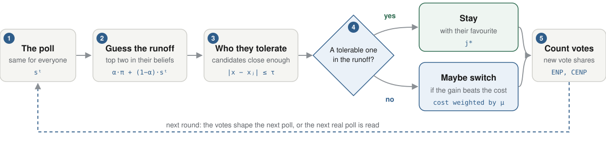

<h1 align="center">The model</h1>

<p align="center">
What each voter sees, what they decide, and how their decisions add up, one round at a time.
</p>

<p align="center"><sub>
<a href="README.md">← Docs</a> · <strong>Model</strong> · <a href="validation.md">Validation →</a>
</sub></p>

## The question

In a two-round election, a voter whose favourite cannot reach the runoff can vote sincerely and risk having nobody
they like in round two, or switch to a compromise candidate who can qualify. The model asks when that individual
choice adds up to visible coordination, and when it does not.

France 2002 is the textbook failure: the left split across several candidates and its front-runner missed the
runoff. France 2022 is the contrasting case, with the vote gathering around a few candidates.

The model covers the first round only. The runoff is never simulated; it exists only as the voters' guess of who
will be in it. There is no campaign, no turnout decision, and no candidate enters or leaves the race.

## One round

<picture>
  <source media="(prefers-color-scheme: dark)" srcset="figures/iteration-dark.svg">
  
</picture>

Voters sit on a left-right axis from −1 to 1, and so do the candidates. In every round, each voter:

1. **reads the poll.** Everyone sees the same one, and nobody has private information.
2. **guesses the runoff.** They blend the poll with what they believed at the start, and take the two candidates
   who come out ahead.
3. **lists the candidates they tolerate**, the ones close enough to them on the axis.
4. **checks whether one of those is in the runoff.** If so, their side already has a representative, and they stay
   with their favourite.
5. **otherwise, considers switching** to a tolerable candidate with a better chance, and does so only when the gain
   outweighs the cost of leaving their favourite.

The votes are then counted. In the synthetic mode the new shares produce the next poll, so the polls and the votes
pull on each other. In the empirical mode the next poll is the next real one, whatever the simulated voters did.

<details>
<summary><strong>How many rounds, and what the output records</strong></summary>

<br>

The loop runs for `max_iterations` rounds: 25 in the synthetic mode, and as many as there are polls in the real
timeline in the empirical mode.

Round 0 is the sincere vote, with no strategic step. So `history` has *n*+1 entries while the diagnostic series
have *n*. The offset is intended, and
[`test_the_histories_line_up_on_the_documented_offset`](../tests/test_dynamic_invariants.py) pins it.

</details>

## Two modes

| | Synthetic | Empirical |
|---|---|---|
| Candidates | generated, evenly spaced | the real ones, placed on [−1, 1] |
| Voters | generated from a mixture | sampled from real self-placements |
| Poll | **made by the model** from current support | **read from** the real poll timeline |
| Question | which parameters drive coordination? | does it reproduce the 2002 and 2022 patterns? |
| Code | [`analysis/synthetic/`](../analysis/synthetic) | [`analysis/empirical/`](../analysis/empirical) |

The difference in the poll matters throughout. In the empirical mode nothing generates the poll, so every parameter
that shapes a generated poll has no effect there ([which ones](#which-parameters-do-nothing-in-the-empirical-mode)).

## Where voters start

Before the first poll, each voter picks a favourite, the candidate they vote for by default. Two rules exist.

**The nearest candidate.** Each voter takes the candidate closest to them. It is simple, and on real candidate sets
it fails in an informative way: it looks only at distance, so a minor candidate who happens to sit where many voters
are gets a very large share. The rule is kept as the baseline because of that failure.

**A draw.** Each voter draws a favourite among the candidates they tolerate, favouring the closer ones and the ones
that look salient: either high in the opening poll, or high in the voter's own starting beliefs. A single parameter,
β, sets how much closeness counts against salience.

<details>
<summary><strong>The draw, in equations</strong></summary>

<br>

> *P<sub>a</sub>(j) ∝ salience<sub>a,j</sub> · exp(−β (x<sub>a</sub> − x<sub>j</sub>)²)*, for *j ∈ C<sub>a</sub>*

| Parameter | Role |
|---|---|
| **β** ≥ 0 | How much ideology counts. At β = 0 salience decides alone. As β → ∞ all the weight goes to the nearest tolerable candidate, which recovers the nearest rule. |
| `salience_source="signal"` | salience is the opening poll *s*<sup>0</sup> |
| `salience_source="prior"` | salience is the voter's own prior π<sub>a</sub> ~ Dirichlet(ρ<sub>π</sub>·*s*<sup>0</sup>) |

Analytic tests pin both limits of β, so an effect of β in the sweeps can be read directly.

</details>

<details>
<summary><strong>Randomness and seeds</strong></summary>

<br>

Every random step draws from a seeded `numpy.random.Generator`. The same seed gives bit-identical output, including
the voter sample, the priors and the draws of favourites. Each run's seed in a sweep is derived from its position:

```
run_seed = seed + 1000 * (draw + 1) + repeat
```

so a sweep that is interrupted and resumed gives exactly the same output as one that is not.

</details>

## How much a voter tolerates

A voter tolerates the candidates within a distance τ of them on the axis. Those are the candidates they would accept
as a compromise.

The distance is set in *zones* rather than on the raw axis. With *K* candidates, the axis is cut into *K* zones of
length 2/*K*, and the design variable τ̂ counts how many zones a voter reaches. One τ̂ therefore means the same thing
in a race of 15 candidates and in a race of 12, which is what a comparison of 2002 and 2022 needs.

| τ̂ | τ in 2002 (*K* = 15) | τ in 2022 (*K* = 12) |
|---|---|---|
| 0.5 | 0.067 | 0.083 |
| 1.5 | 0.200 | 0.250 |
| 3.0 | 0.400 | 0.500 |

<details>
<summary><strong>The two units, and where one becomes the other</strong></summary>

<br>

| | Symbol | Units | Where it is used |
|---|---|---|---|
| **Normalized** | **τ̂** (`tau_hat`) | zone lengths | the design variable: what every sweep draws and every CSV records |
| **Absolute** | **τ** (`tau`) | distance on [−1, 1] | what `run_simulation(tau=…)` takes |

> **τ = τ̂ × 2/*K***

The conversion happens exactly once, in [`core_model/metrics.py`](../core_model/metrics.py):

```python
def zone_length(K: int) -> float:
    return 2.0 / K

def tau_absolute(tau_hat: float, K: int) -> float:
    return tau_hat * zone_length(K)
```

Callers convert immediately before `run_simulation` and record both values. A test checks that the conversion
happens once and that `tau_hat` is never changed.

Every empirical replay and sweep row carries `tau_hat`, `tau_absolute` and `K`, so the relation can be checked from
the CSV alone. [`tools/validate_rerun.py`](../tools/validate_rerun.py) enforces it to 1e-12.

</details>

<details>
<summary><strong>Why the units matter: the bug they caused</strong></summary>

<br>

Passing τ̂ where τ is expected reads a number of zones as a distance, much like reading centimetres as metres. At
τ ≥ 2 every candidate is tolerable for every voter, so the switching condition can never hold and nobody ever
switches.

That happened in the empirical results before 2026-08-21, where 40% of the design sat at τ ≥ 2. The model now warns
at τ ≥ 2, and the warning appears zero times in the 30 simulation logs of the corrected run.

</details>

<details>
<summary><strong>One intentional exception</strong></summary>

<br>

`initialization_benchmarks()` passes `tau=2.0` in absolute units on purpose, so that every candidate is tolerable.
Those benchmarks compare the ways of choosing a favourite on the same footing, and restricting who is tolerable would
mix the rule being measured with the size of the tolerable set. The value is not a swept draw, and it is commented
as an exception at [`empirical_2002_2022.py:554`](../analysis/empirical/empirical_2002_2022.py#L554).

</details>

## What voters believe

Each voter starts with their own idea of how the candidates stand, their *prior*, drawn around the opening poll.
In every round they blend that prior with the latest poll. The weight α sets the mix: at α = 0 they trust the poll
fully, at α = 1 they ignore it.

Voters always go back to their starting beliefs rather than to last round's. Their inertia comes from where they
started, not from a belief that drifts over time.

In the synthetic mode the model makes each poll from the current vote shares. A temperature θ exaggerates or flattens
the gaps between candidates, and noise blurs the result. In the empirical mode the poll is the real one.

<details>
<summary><strong>Beliefs, in equations</strong></summary>

<br>

> *t* = 0: *m<sup>0</sup><sub>a</sub> = π<sub>a</sub>*
>
> *t* > 0: *m<sup>t</sup><sub>a</sub> = α · π<sub>a</sub> + (1 − α) · s<sup>t</sup>*

| Parameter | Meaning |
|---|---|
| **α** (`alpha_prior`) | weight on the fixed prior. 0 trusts the poll fully; 1 ignores it. |
| **ρ<sub>π</sub>** (`rho_pi`) | precision of the prior π<sub>a</sub> ~ Dirichlet(ρ<sub>π</sub>·*s*<sup>0</sup>). Higher values keep priors close to the opening poll. |

At *t* = 0 the belief is π<sub>a</sub> itself, which avoids counting *s*<sup>0</sup> twice, since that poll already
generated π<sub>a</sub>.

</details>

<details>
<summary><strong>Generated polls, in equations</strong></summary>

<br>

> *s̃<sub>i</sub> = (δ<sub>i</sub> + ε<sub>s</sub>)<sup>1/θ</sup> / Σ<sub>j</sub> (δ<sub>j</sub> + ε<sub>s</sub>)<sup>1/θ</sup>*, then *s ~ Dirichlet(ρ<sub>s</sub> · s̃)*

| Parameter | Meaning |
|---|---|
| **θ** (`theta`) | temperature. θ < 1 widens the gaps between candidates; θ = 1 keeps them; θ > 1 narrows them. |
| **ρ<sub>s</sub>** (`rho`) | precision of the Dirichlet draw. Higher means less noise. |
| **ε<sub>s</sub>** (`signal_epsilon`) | a floor, so a candidate with no support still gets a strictly positive weight. Default `1e-12`. |

ε<sub>s</sub> is `1e-12`, not `1e-4`. It only keeps the computation valid and does no smoothing. Earlier
documentation quoted `1e-4`, which is obsolete. The default is set at [`model.py:96`](../core_model/model.py#L96) and
[`signals.py`](../core_model/signals.py), and [`tests/test_signal_epsilon.py`](../tests/test_signal_epsilon.py)
(25 tests) pins it.

</details>

<details>
<summary><strong>Real polls</strong></summary>

<br>

In the empirical mode the sequence of polls is the real timeline, with no generation step: weekly means by default,
and individual polls as a robustness variant. `max_iterations` equals the length of that sequence.

</details>

### Which parameters do nothing in the empirical mode

Because the poll is read rather than made, these parameters have no effect in the empirical mode:

| Parameter | Why it does nothing |
|---|---|
| **θ** (temperature) | a real poll is not transformed |
| **ρ<sub>s</sub>** (poll noise) | no Dirichlet draw is taken |
| **ε<sub>s</sub>** (poll floor) | it is only used to generate polls |
| **ξ** (electorate skew), ***c*** (width) | the electorate is sampled from real data |
| **ε<sub>F</sub>** (floor weight) | it belongs to the generated electorate |

The ones that stay active are τ̂, μ, α, ρ<sub>π</sub>, and β when favourites are drawn. The behavioural sweep leaves
ρ<sub>s</sub> out on purpose for this reason: sweeping a parameter with no effect would only produce a null result.

## When a voter switches

A voter considers switching only when **none of the candidates they tolerate is among the two they expect in the
runoff**. That is the trigger. It depends on the voter's guess about the runoff, not on how strongly they feel about
their favourite.

A triggered voter then compares the tolerable candidates. Each one is worth more the better its chances: how strong
it looks among the voter's tolerable candidates, and how well it would do in a runoff against the strongest
candidate the voter does not tolerate. Leaving the favourite has a cost that grows with the distance to the new
candidate, weighted by μ. At μ = 0 the choice is purely practical; a large μ keeps the voter with their favourite.

<details>
<summary><strong>The rule, in equations</strong></summary>

<br>

**Tolerable set.** *C<sub>a</sub> = { j : |x<sub>a</sub> − x<sub>j</sub>| ≤ τ }*, and *O<sub>a</sub>* is everything
else. The boundary is inclusive. By construction the favourite *j\** is always in *C<sub>a</sub>*, so
*C<sub>a</sub>* is never empty.

**Runoff guess.** Each voter ranks the candidates by their own belief and takes the top *K*<sub>runoff</sub> (2 for
a presidential election): *T<sub>R</sub> = argmax<sub>2</sub> m<sub>a</sub>*.

**Trigger.**

> ***G<sub>a</sub>* = 1 iff *C<sub>a</sub> ∩ T<sub>R</sub>* = ∅**

**Choice.** When *G<sub>a</sub>* = 1, the voter picks the *j ∈ C<sub>a</sub>* that maximizes

> *φ<sub>a</sub>(j) = LV<sub>a,j</sub> · NV<sub>a,j,k\*</sub> − μ · λ̂<sub>a</sub>(j)*, with no cost on *j = j\**

| Term | Definition |
|---|---|
| *LV<sub>a,j</sub>* | local viability: *m<sub>a,j</sub>* renormalized over *C<sub>a</sub>* |
| *NV<sub>a,j,k\*</sub>* | the projected runoff share of *j* against the strongest opponent *k\** |
| *λ̂<sub>a</sub>(j)* | the cost of leaving the favourite, *(u<sub>a</sub>(j\*) − u<sub>a</sub>(j)) / ℓ²* ≥ 0, with *u<sub>a</sub>(j) = −(x<sub>a</sub> − x<sub>j</sub>)²* |
| **μ** | the weight of that cost. At μ = 0 the choice is purely instrumental; a large μ keeps the voter on *j\**. |

The cost is divided by ℓ² = (2/*K*)² so that μ stays comparable across races of different size, for the same reason
as τ̂.

</details>

<details>
<summary><strong>Three rates that separate pressure from action</strong></summary>

<br>

| Rate | Definition |
|---|---|
| **Trigger rate** | share of voters with *G<sub>a</sub>* = 1 |
| **Switching rate** | share of *all* voters who end up away from their favourite |
| **Conditional switching** | share of *triggered* voters who actually switch |

The third separates the pressure from the behaviour. A high trigger rate with little conditional switching means the
incentive is there, but μ or the candidates' chances hold voters back. The rates are recorded for each draw and
summarized in [`empirical_activation_summary.csv`](../results/tables/empirical_activation_summary.csv).

</details>

## How coordination is measured

The main measure is the **effective number of parties**, ENP. Four candidates with a quarter of the vote each give
an ENP of 4; if one candidate takes almost everything, ENP is close to 1. **CENP** rescales it between 0 (the vote is
spread as evenly as it can be) and 1 (it is all on one candidate), so races with different numbers of candidates can
be compared.

**ΔCENP** is how much CENP changes, and a positive value means the vote concentrated. It is the number the replay of
2002 and 2022 is judged on.

<details>
<summary><strong>ENP and CENP, in equations</strong></summary>

<br>

> **ENP(δ) = 1 / Σ<sub>j</sub> δ<sub>j</sub>²**
>
> **CENP(δ) = (*K* − ENP(δ)) / (*K* − 1)** ∈ [0, 1]

ENP is the Laakso–Taagepera index, and δ is the vector of vote shares.

</details>

### Two kinds of ΔCENP

ΔCENP needs a starting point, and the project uses two. They are different quantities, and they must not be mixed.

| | Starting point | Where | Can it be compared with the real election? |
|---|---|---|---|
| **Replay** | the model's own sincere vote in round 0 | `functions.coordination_measures(sincere, final)` | **No** |
| **Sweep** | the real opening poll *s*<sup>0</sup> | `cenp(final) − cenp(s⁰)` at [`behavioral_sweep.py:215`](../analysis/empirical/behavioral_sweep.py#L215) | **Yes** |

The real target is *CENP(result) − CENP(s*<sup>0</sup>*)*, so only the sweep's ΔCENP can be set against the election.
The replay's ΔCENP measures something else: how far the model moved from its own starting point.

The two are kept as separate implementations on purpose. A contract test pins each one against drift, and does not
assert that they are equal.

<details>
<summary><strong>Candidate-level outcomes</strong></summary>

<br>

For each candidate: the mean final share with a 5th–95th percentile band, the change from the first poll, and the
probability of finishing in the top *k*. They are exported to
[`empirical_candidate_fit.csv`](../results/tables/empirical_candidate_fit.csv).

Top-*k* accuracy is an exact set match. It is 1 only if the simulated top *k* equals the real top *k*, and 0
otherwise, with no partial credit, so values of exactly 0 are common.

</details>

<details>
<summary><strong>The cliff</strong></summary>

<br>

The cliff is the largest gap in the sorted vote shares, the point that separates the viable candidates from the
rest. A sharp cliff means a clear line between them; a flat profile means there is none.

| Statistic | Meaning |
|---|---|
| `cliff_magnitude` | size of the largest gap |
| `cliff_location` | the rank at which it falls |
| `cliff_ratio` | the share of the vote above it |

</details>

<details>
<summary><strong>The code's names for all this</strong></summary>

<br>

**Candidates** (`Party`) sit at a fixed position and do not act.

| Field | Type | Meaning |
|---|---|---|
| `partyID` | `int` | position in the candidate list; all downstream data are indexed by it |
| `position` | `float` | place on [−1, 1] |

Everything is indexed by position in the list. If the order silently differed between `party_positions_*.csv`,
`polls_*.csv` and `results_*.csv`, every candidate-level result would be wrong without any error, which is why the
[data-integrity tests](validation.md#data-and-numbers) exist.

**Voters** (`Elector`):

| Field | Meaning |
|---|---|
| `position` | place on [−1, 1] |
| `sincereUtilities` | *u<sub>a</sub>(j) = −(x<sub>a</sub> − x<sub>j</sub>)²* for every candidate |
| `contenders` (*C<sub>a</sub>*) | the candidates within τ, the ones the voter tolerates |
| `opponents` (*O<sub>a</sub>*) | everyone else |
| `attachment` | the favourite *j\** |
| `posteriorBeliefs` (*m<sub>a</sub>*) | the current belief about how the candidates stand |
| `triggered` | whether the voter considers switching this round |
| `strategicUtilities` | *φ<sub>a</sub>(j)*, the score the voter maximizes |

**The poll** is a single vector *s<sup>t</sup>* over the *K* candidates, summing to 1, and the same for every voter.

</details>

---

<p align="center"><sub>
<a href="README.md">← Docs</a> · <strong>Model</strong> · <a href="validation.md">Validation →</a>
</sub></p>
