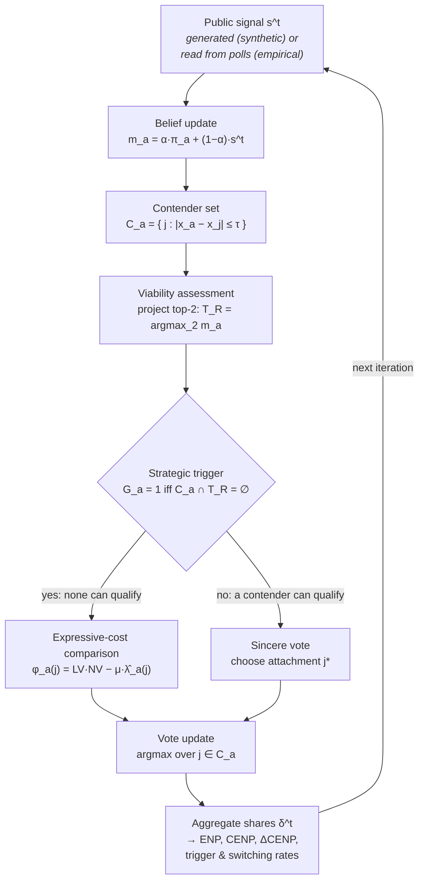

# Model

[← Index](index.md) · **Model** · [Validation →](validation.md)

- [Overview](#overview)
- [Entities and state](#entities-and-state)
- [One complete iteration](#one-complete-iteration)
- [Initialization](#initialization)
- [Tolerance: the two units](#tolerance-the-two-units)
- [Signals and belief updating](#signals-and-belief-updating)
- [Strategic choice](#strategic-choice)
- [Outcome measures](#outcome-measures)

---

## Overview

### Research question

Under a two-round runoff, a voter whose preferred candidate cannot reach the
runoff faces a choice: vote sincerely and risk having no representative in
round two, or switch to a compromise candidate who can qualify. **When does
that individual incentive aggregate into visible coordination, and when does it
fail?**

France 2002 is the canonical failure: the left vote split across several
candidates and the Socialist front-runner missed the runoff. France 2022 is the
contrasting case, with visible consolidation around a few candidates.

### Modelling scope

The model covers **the first round only**. Round two is never simulated — it
enters solely as a *projection* that voters form about who will qualify. There
is no campaign, no turnout decision, no abstention, and no candidate entry or
exit.

### Two modes

| | **Synthetic** | **Empirical** |
|---|---|---|
| Party positions | generated, evenly spaced | real candidates, coded on [−1, 1] |
| Electorate | generated from a mixture | sampled from a real ideology histogram |
| Poll signal | **generated** each iteration from current support | **exogenous** real poll timeline |
| Question | which parameters drive coordination? | does it reproduce 2002 vs 2022 patterns? |
| Code | [`analysis/synthetic/`](../analysis/synthetic) | [`analysis/empirical/`](../analysis/empirical) |

The distinction matters throughout: in empirical mode the signal is read from
data rather than generated, so **every signal-generating parameter is inert**
(see [below](#which-parameters-are-inactive-in-empirical-replay)).

---

## Entities and state

### Party

A candidate at a fixed ideological position. Parties do not act.

| Field | Type | Meaning |
|---|---|---|
| `partyID` | `int` | positional index — **all downstream data is indexed by this** |
| `position` | `float` | ideology on [−1, 1] |

> ⚠️ Everything is indexed positionally. A silent re-ordering between
> `party_positions_*.csv`, `polls_*.csv` and `results_*.csv` would corrupt every
> candidate-level result without raising an error. This is why
> [data-integrity tests](validation.md#4--data-integrity) exist.

### Elector (voter)

| Field | Meaning |
|---|---|
| `position` | ideology on [−1, 1] |
| `sincereUtilities` | *u<sub>a</sub>(j) = −(x<sub>a</sub> − x<sub>j</sub>)²* for every party |
| `contenders` (*C<sub>a</sub>*) | parties within tolerance τ — the voter's acceptable set |
| `opponents` (*O<sub>a</sub>*) | everything else |
| `attachment` | the voter's expressive "home" party *j\** |
| `posteriorBeliefs` (*m<sub>a</sub>*) | current belief over who will place where |
| `triggered` | whether the strategic incentive is active this iteration |
| `strategicUtilities` | *φ<sub>a</sub>(j)*, the score actually maximised |

### Public signal

A single shared vector *s<sup>t</sup>* over the *K* candidates, summing to 1.
Generated in synthetic mode; read from the real poll timeline in empirical mode.
Every voter sees the same signal — there is no private information channel.

---

## One complete iteration



The loop runs to `max_iterations` (synthetic: *T* = 25; empirical: the length of
the real poll sequence). Iteration 0 is the **sincere** allocation and carries no
strategic step, which is why `history` has *n+1* entries while the diagnostic
series have *n* — a documented offset pinned by
[`test_the_histories_line_up_on_the_documented_offset`](../tests/test_dynamic_invariants.py).

---

## Initialization

At iteration 0 every voter is assigned an **attachment** *j\**, the party they
express by default. Two rules exist.

### Nearest-party (deterministic)

*j\** = argmax<sub>j</sub> *u<sub>a</sub>(j)* — simply the closest candidate. One
vote each, no randomness.

> This rule is **pathological on real candidate sets**. Because it only looks at
> distance, it hands enormous shares to whichever candidate happens to sit in a
> dense ideological region regardless of viability. It is retained as the
> baseline specification precisely because that failure is informative.

### Probabilistic

Voters draw their attachment from within their contender set:

> *P<sub>a</sub>(j) ∝ salience<sub>a,j</sub> · exp(−β (x<sub>a</sub> − x<sub>j</sub>)²)*,  for *j ∈ C<sub>a</sub>*

| Parameter | Role |
|---|---|
| **β** ≥ 0 | ideological sharpness. **β = 0** → salience alone, ideology drops out. **β → ∞** → all mass on the nearest contender (recovers the nearest rule). |
| `salience_source="signal"` | salience = the opening poll *s<sup>0</sup>* |
| `salience_source="prior"` | salience = the voter's own prior π<sub>a</sub> ~ Dirichlet(ρ<sub>π</sub>·*s*<sup>0</sup>) |

Both β limits are pinned by analytic tests, so a β effect in the sweeps is
interpretable rather than a black box.

### Fixed-seed stochasticity

Every stochastic step draws from a seeded `numpy.random.Generator`. Same seed →
bit-identical output, including the voter sample, the priors and the attachment
draws. Per-run seeds in the sweeps are derived deterministically:

```
run_seed = seed + 1000 * (draw + 1) + repeat
```

so a resumed run reproduces an uninterrupted one exactly.

---

## Tolerance: the two units

**This is the single most error-prone quantity in the project.** Two different
things are called "tau".

| | Symbol | Units | Where used |
|---|---|---|---|
| **Normalised** | **τ̂** (`tau_hat`) | *zone lengths* | the design variable — what every sweep draws and every CSV records |
| **Absolute** | **τ** (`tau`) | ideology units on [−1, 1] | what `run_simulation(tau=…)` actually consumes |

They are related through the **zone length** ℓ = 2/*K*:

> **τ = τ̂ × (2 / K)**

### Why the absolute value differs between 2002 and 2022

*K* is the number of candidates, and it differs by year — **15 in 2002, 12 in
2022**. So one shared τ̂ draw maps to a *different* absolute tolerance in each
year:

| τ̂ | → τ in 2002 (K=15) | → τ in 2022 (K=12) |
|---|---|---|
| 0.5 | 0.067 | 0.083 |
| 1.5 | 0.200 | 0.250 |
| 3.0 | **0.400** | **0.500** |

That is the point: τ̂ is comparable across party systems of different size,
which is exactly what a two-election comparison needs.

### Where the conversion occurs

**Exactly once**, in [`core_model/metrics.py`](../core_model/metrics.py):

```python
def zone_length(K: int) -> float:
    return 2.0 / K

def tau_absolute(tau_hat: float, K: int) -> float:
    return tau_hat * zone_length(K)
```

Callers convert immediately before `run_simulation` and record both values. A
test asserts the conversion happens once and that `tau_hat` is never mutated.

> **Why this matters.** Passing τ̂ straight through silently reinterprets it as
> an absolute distance. At τ ≥ 2 **every party is a contender for every voter**,
> so *C<sub>a</sub> ∩ T<sub>R</sub> = ∅* never holds, the trigger never fires,
> and the strategic module is inert. That defect affected the pre-2026-08-21
> empirical results, where 40 % of the design sat at τ ≥ 2 outright. The model
> emits a `UserWarning` at τ ≥ 2; zero occurrences appear in the corrected run's
> 30 simulation logs.

### How outputs record both

Every empirical replay and sweep row carries `tau_hat`, `tau_absolute` **and**
`K`, so the relation is checkable from the CSV alone with no knowledge of how it
was produced. [`tools/validate_rerun.py`](../tools/validate_rerun.py) enforces it
to 1e-12.

<details>
<summary><b>One intentional exception</b></summary>

`initialization_benchmarks()` passes `tau=2.0` in *absolute* units deliberately,
so that every party is a contender. Those benchmarks compare the three
attachment rules on identical footing; restricting the contender set would
confound the rule being measured with the size of *C<sub>a</sub>*. This is not a
swept draw, and it is commented as an exception at
[`empirical_2002_2022.py:511`](../analysis/empirical/empirical_2002_2022.py).
</details>

---

## Signals and belief updating

### Synthetic: generated signals

> *s̃<sub>i</sub> = (δ<sub>i</sub> + ε<sub>s</sub>)<sup>1/θ</sup> / Σ<sub>j</sub> (δ<sub>j</sub> + ε<sub>s</sub>)<sup>1/θ</sup>*,  then  *s ~ Dirichlet(ρ<sub>s</sub> · s̃)*

| Parameter | Meaning |
|---|---|
| **θ** (`theta`) | signal *temperature*. θ < 1 sharpens viability gaps; θ = 1 faithful; θ > 1 compresses them. |
| **ρ<sub>s</sub>** (`rho`) | Dirichlet precision — higher is less noisy. |
| **ε<sub>s</sub>** (`signal_epsilon`) | numerical floor so a zero-support party still gets strictly positive concentration. **Default `1e-12`.** |

> ⚠️ **ε<sub>s</sub> = 1e-12, not 1e-4.** The floor is a numerical guard, not a
> smoothing parameter. Earlier documentation quoted `1e-4`; that value is
> obsolete. The current default is at
> [`model.py:100`](../core_model/model.py) and
> [`signals.py`](../core_model/signals.py), and is pinned by
> [`tests/test_signal_epsilon.py`](../tests/test_signal_epsilon.py) (25 tests).

### Empirical: exogenous poll timelines

The signal sequence is the **real poll timeline** — no generation step. Weekly
means by default; individual polls as a robustness variant. `max_iterations`
equals the length of that sequence.

### Belief update

> *t = 0*:  *m<sup>0</sup><sub>a</sub> = π<sub>a</sub>*
> *t > 0*:  *m<sup>t</sup><sub>a</sub> = α · π<sub>a</sub> + (1 − α) · s<sup>t</sup>*

| Parameter | Meaning |
|---|---|
| **α** (`alpha_prior`) | weight on the fixed prior. 0 = trust the poll fully; 1 = ignore it. |
| **ρ<sub>π</sub>** (`rho_pi`) | precision of the voter's prior π<sub>a</sub> ~ Dirichlet(ρ<sub>π</sub>·*s*<sup>0</sup>). Higher → priors cluster tightly on the opening poll. |

The previous posterior is **never reused** — inertia is anchored to the fixed
prior π<sub>a</sub>, not to an evolving belief state. At *t = 0* the posterior is
set to π<sub>a</sub> directly, avoiding double-counting *s*<sup>0</sup> (which
already generated π<sub>a</sub>).

### Which parameters are inactive in empirical replay

Because the signal is read rather than generated, these have **nothing to do**:

| Inert in empirical mode | Why |
|---|---|
| **θ** (temperature) | no transformation is applied to a real poll |
| **ρ<sub>s</sub>** (signal precision) | no Dirichlet draw is taken |
| **ε<sub>s</sub>** (signal floor) | only used inside signal generation |
| **ξ** (electorate skew), **c** (width) | the electorate is sampled from real data |
| **ε<sub>F</sub>** (floor weight) | belongs to the generated electorate mixture |

The behavioural sweep deliberately **excludes ρ<sub>s</sub> as a placebo
dimension** for exactly this reason. Active parameters in empirical mode are
**τ̂, μ, α, ρ<sub>π</sub>** and — under probabilistic initialization — **β**.

---

## Strategic choice

### Contender set

> *C<sub>a</sub> = { j : |x<sub>a</sub> − x<sub>j</sub>| ≤ τ }*,  *O<sub>a</sub>* = everything else

The boundary is **inclusive**. Two guarantees hold by construction: the sincere
choice *j\** is always in *C<sub>a</sub>*, and *C<sub>a</sub>* is never empty.

### Viability assessment

Each voter ranks candidates by their own posterior belief and projects the top
*K<sub>runoff</sub>* (= 2 for a presidential election) as the qualifiers:
*T<sub>R</sub> = argmax<sub>2</sub> m<sub>a</sub>*.

### Trigger

> **G<sub>a</sub> = 1  iff  C<sub>a</sub> ∩ T<sub>R</sub> = ∅**

In words: *the voter has a strategic incentive only when none of the candidates
they can tolerate is projected to reach the runoff.* If a contender is projected
to qualify, the voter's bloc already has a representative and they vote
sincerely. Note this depends on the **projection**, not on the voter's own
preference intensity.

### Expressive-cost comparison

When *G<sub>a</sub> = 1*, the voter maximises over *j ∈ C<sub>a</sub>*:

> *φ<sub>a</sub>(j) = LV<sub>a,j</sub> · NV<sub>a,j,k\*</sub> − μ · λ̂<sub>a</sub>(j)*  (no penalty on *j = j\**)

| Term | Definition |
|---|---|
| *LV<sub>a,j</sub>* | local viability — *m<sub>a,j</sub>* renormalised over *C<sub>a</sub>* |
| *NV<sub>a,j,k\*</sub>* | projected runoff share of *j* against the strongest opponent *k\** |
| *λ̂<sub>a</sub>(j)* | expressive cost, *(u<sub>a</sub>(j\*) − u<sub>a</sub>(j)) / ℓ²* ≥ 0 |
| **μ** | loyalty weight. μ = 0 → pure instrumental choice; large μ pins the voter to *j\**. |

> The cost is normalised by **ℓ² = (2/K)²** so that μ is comparable across party
> systems of different size — the same reasoning as for τ̂.

### Switching and conditional switching

| Rate | Definition |
|---|---|
| **trigger rate** | share of voters with *G<sub>a</sub> = 1* |
| **switching rate** | share of *all* voters who end up away from *j\** |
| **conditional switching** | share of *triggered* voters who actually switch |

The third separates the *pressure* layer from the *behavioural* layer: a high
trigger rate with low conditional switching means the incentive exists but μ or
the viability terms suppress action.

---

## Outcome measures

### ENP and CENP

> **ENP(δ) = 1 / Σ<sub>j</sub> δ<sub>j</sub>²**  — effective number of parties
> **CENP(δ) = (K − ENP(δ)) / (K − 1)** ∈ [0, 1] — coordination-scaled

ENP is the standard Laakso–Taagepera index: an electorate split evenly across 4
candidates has ENP = 4. CENP rescales it so that **0 = maximal fragmentation**
and **1 = full coordination**, making different *K* comparable.

### ΔCENP — two baselines that must never be mixed

> ⚠️ **This is the second most error-prone quantity after τ.** The project uses
> two different ΔCENP definitions, deliberately, and they are *not* equal.

| | Baseline | Where | Comparable to observation? |
|---|---|---|---|
| **Replay** | the model's **own iteration-0 sincere shares** | `functions.coordination_measures(sincere, final)` | **No** |
| **Sweep** | the **exogenous opening poll s⁰** | `cenp(final) − cenp(s⁰)` at [`behavioral_sweep.py:199`](../analysis/empirical/behavioral_sweep.py) | **Yes** |

The observed target is *CENP(actual result) − CENP(s⁰)*, so **only the sweep
definition may be compared with the real election.** The replay's ΔCENP measures
something else: how much the model's own dynamics moved it away from its own
starting point.

The two are intentionally left as separate implementations. A contract test
pins them against drift, and deliberately **does not** assert they are equal.

### Trigger and switching rates

As defined [above](#switching-and-conditional-switching). Recorded per draw and
aggregated in
[`empirical_activation_summary.csv`](../results/tables/empirical_activation_summary.csv).

### Candidate-level outcomes

Per candidate: mean final share with a p05–p95 band, change from the first
signal, and top-*k* membership probability. Exported to
[`empirical_candidate_fit.csv`](../results/tables/empirical_candidate_fit.csv).

**Top-*k* accuracy is an exact set match** — 1.0 only if the simulated top-*k*
set equals the actual top-*k* set, 0.0 otherwise. It is not a partial-credit
measure, which is why values of exactly 0 are common.

### Cliff statistics

The "cliff" is the largest gap in the sorted share vector — the point separating
viable from non-viable candidates.

| Statistic | Meaning |
|---|---|
| `cliff_magnitude` | size of the largest gap |
| `cliff_location` | rank position where it falls |
| `cliff_ratio` | share mass above the cliff |

A sharp cliff means a clear viability boundary; a flat profile means none.

---

[← Index](index.md) · **Model** · [Validation →](validation.md)
